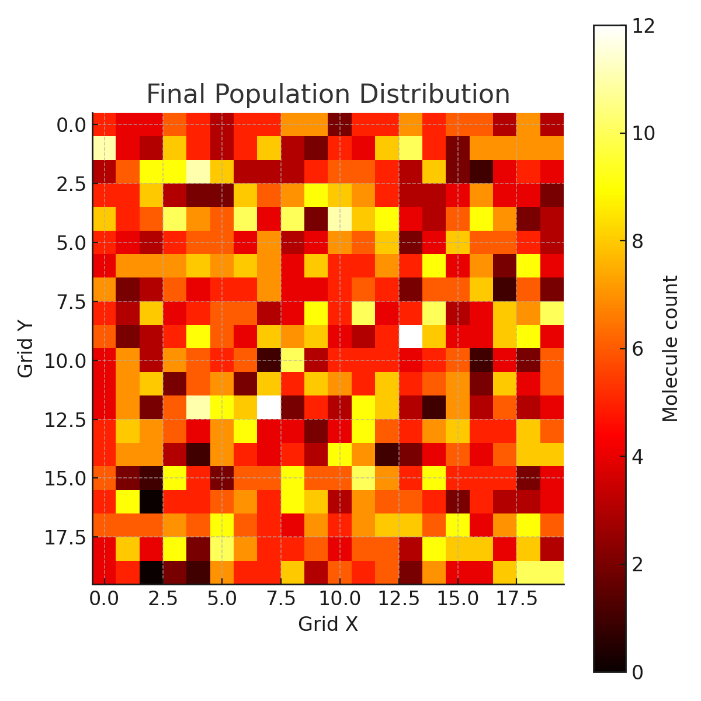

# RNA World Simulation

This repository contains simple Python simulations that demonstrate how life could have emerged from the RNA world — an early stage of evolution before DNA and proteins.

We simulate:
- Self-replicating RNA molecules (ribozymes)
- Evolution over generations
- Mutations and selection
- Spatial behavior in a 2D environment

## Demo

Watch the YouTube video: [INSERT LINK]

## Files

- `rna_world_simulation_english.py`: Basic evolutionary model (1D population)
- `rna_spatial_simulation.py`: 2D grid simulation with localized replication
- `rna_world_youtube_script.txt`: Full video script
- `rna_world_subtitles.srt`: Sample subtitles
- `rna_world_youtube_description.txt`: Optimized YouTube description

## Requirements

- Python 3.9+
- `matplotlib`
- `numpy`

Install with:

```bash
pip install matplotlib numpy
```

## How to run

```bash
python 01_rna_world_simulation.py
```
For scripts with bokeh suffix in the name:
```bash
python -m bokeh serve --show 10_rna_spatial_simulation_dashboard_bokeh.py
```

## Screenshot



## License

MIT License
